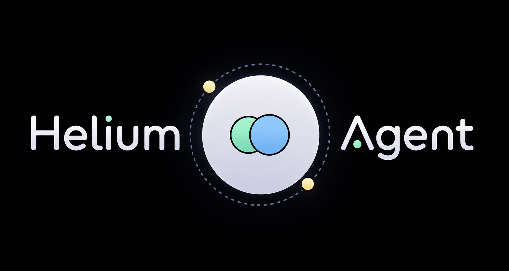

# Helium Agent

Helium is a lightweight local AI agent that does everything your everyday agent does but without the massive bill and with your own customization. You can run any LLM be it local or cloud inside Helium. But to have the total experience of freedom I would suggest to integrate a local LLM either using ollama, llama.cpp or any inference technology of your choice.

Helium is still developing and more features are added as you read this. I would really love for you to contribute to this and make a part of Helium your own.

> [!TIP]
> If you directly want to try go to [usage](#usage) section.

## What It Can Do

- **Answer everyday questions:** Just like any other agent it can repsond to any mundane queries you might have. It won't judge you.
- **Tool calling:** Helium can calls tools it has to perform complex operations in order to respond to your queries.
- **Coding**: It can perform long coding tasks with the help of `agentic loop` build inside it.
- **Deep Research:** For queries that include an `in-depth` knowledge and information retrieval Helium will take help of its research tool to provide with most accurate repsonse with proper citations.
- **Web Search:** It can use `DuckDuckGoSearch` API to get web results and if necessary it will use `playwright` to dig deeper into complex websites all to make sure you get the best answer.
- **RAG:** Currently a simple RAG pipeline is integrated where only 1 file at a time can be given to Helium and it will respond accordingly. [Future plans to scale this]
- **Bash execution:** Helium can perform `safe` bash operations in its terminal.
- **Long-term memory:** It uses a `in-memory sqlite` database which is currently session-scoped to remember important facts.

## Prerequisites

Helium is optimized for **macOS on Apple Silicon** but I have tested it across platforms so you shouldn't face any problems but if you do please raise `issue`.

You will need:

- Python 3.11+
- A local LLM service, usually `llama.cpp`
- If you have an API endpoint to any LLM you can use that too.

Default service URLs are configured in [`config/settings.py`](config/settings.py) and can be overridden in [`config/settings.toml`](config/settings.toml).

## Usage

Helium is packaged to `pypi` so you can just download it and use it directly.

Just install it using `pip`:

```Bash
pip install helium-agent
```

Now, go to the directory where you want Helium to work and just call it:

```bash
helium .
```

For more commands type `/help` in the chat.

## Docker

> [!NOTE]
> Use this if you just want to chat without worrying the technical complexities but make sure to have you `env` configured accordingly.
>
> It will take care of RAG pipeline automatically.

You can build and run the entire terminal application using:

```bash
docker compose up --build
```

You might need to wait for a bit. So, go have a coffee while it is building.

This will run the image:

```bash
docker compose run --rm --service-ports helium
```

The API container is configured to reach host services through `host.docker.internal`. Keep llama.cpp instance running on the host, then update [`docker-compose.yml`](docker-compose.yml) if your ports differ.

## Dev Installation

> [!NOTE]
> Use this only if you want to run it manually otherwise go to [Docker](#docker) section.

1. Clone the repository:

   ```bash
   git clone <repository-url>
   cd helium-agent
   ```

2. Create and activate a virtual environment:

   ```bash
   python -m venv .venv
   source .venv/bin/activate
   ```

3. Install Python dependencies:

   ```bash
   pip install -r requirements.txt
   pip install -r requirements-rag.txt
   ```

4. Doctor command for RAG check:

   ```bash
   python -m rag_service doctor
   ```

## Local Services

> [!NOTE]
> You can either use llama.cpp or any LLM provider API.

### Start llama.cpp

Run a compatible instruction-tuned GGUF model on port `3000`:

```bash
./llama-server -m /path/to/your/model.gguf -c 4096 --port 3000
```

Helium expects the default completion endpoint to be OPENAI compatible version:

```text
http://127.0.0.1:3000/v1/chat/completion
```

### Use LLM API

If you have an API to any LLM provider then you can use them directly by adding the `API Key` to a `.env` file in the directory.

```text
LLM_API_KEY=your-llm-url-llm-api-key
LLM_API_URL=your-llm-url
```

Look at `.env.example` for more detail.

### Start Playwright

Helium comes with playwright compatibility. So, if you want to get more in-depth results from web you can turn on this feature by updating `use_playwright=true` in `config/settings.toml`

Then install playwright and chromium.

```bash
pip install playwright
playright install chromium
```

> These are not added in `requirements.txt` because Helium aims to be lightweight. But you can do whatever you want!

> [!TIP]
> Playwright is heavy as it downloads chromium so it can take some of your memory. Use with caution.

### Start RAG pipeline

Helium comes with its own RAG pipeline. This allows you to add files with `@` prefix to the file path to your file. Then you can ask anything about that file.

Currently it is good enough to answer what is inside it, summarize it, and other basic questions. Later I intend to deepen the understanding of the file using local embeddings.

This is an **optional** feature. Look into `rag_service` directory for more detail.

## Run The Assistant

> Only TEXT mode is ready for use.

1. Confirm the LLM service is running.
2. Confirm your web services are running if you want better results.
3. Start Helium:

   ```bash
   python main.py --mode text
   ```

4. Wait for:

Animation to load and welcome message to be shown.

5. Type your query and enjoy Helium.

Example requests:

```text
What is the latest news on AI?
Remember that I prefer concise responses.
Create a file named hello.txt that says hi.
Open Safari.
Compare India and China GDP in 2025.
Why is the Indian Rupee falling recently?
Give me a report on the latest AI regulation changes in the EU.
```

RAG request example:

```text
@README.md what does this project do?
@docs/plan.pdf summarize the risks
```

## Testing

Run the test suite from the repository root:

```bash
python -m unittest discover -s tests
```


